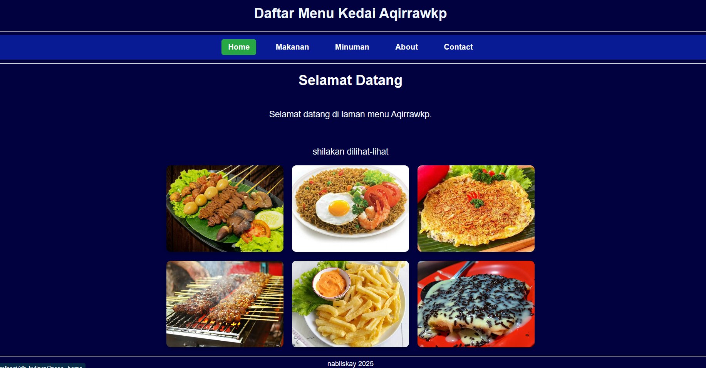
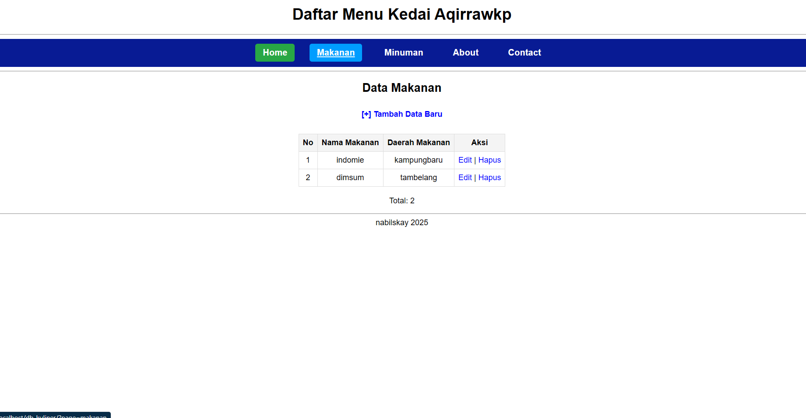
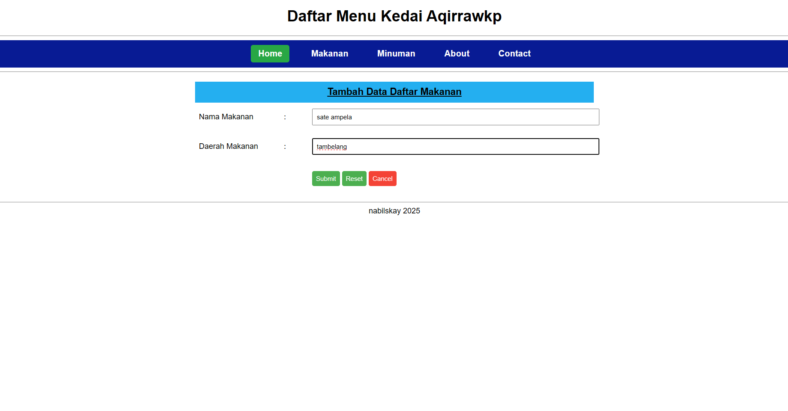
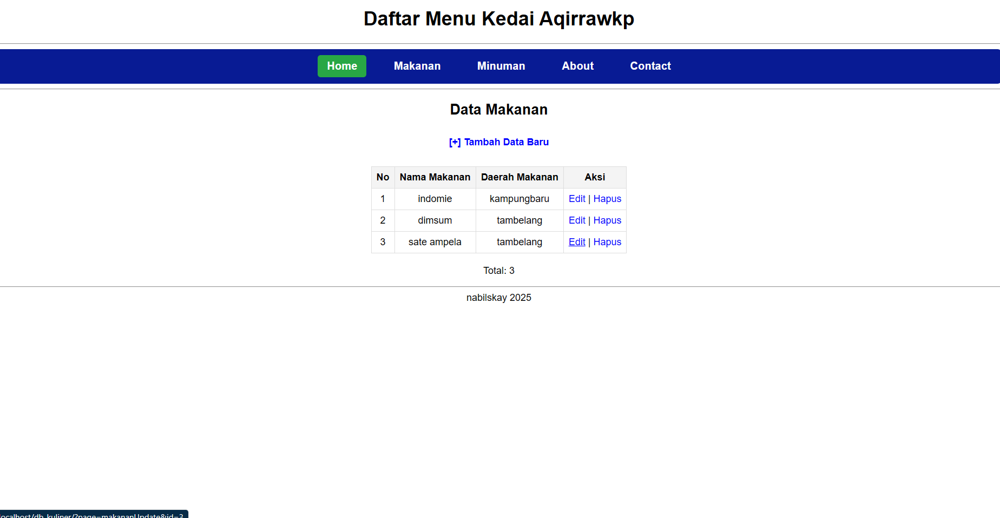
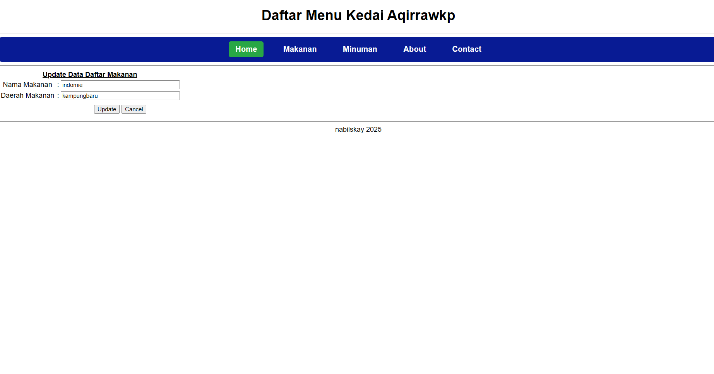
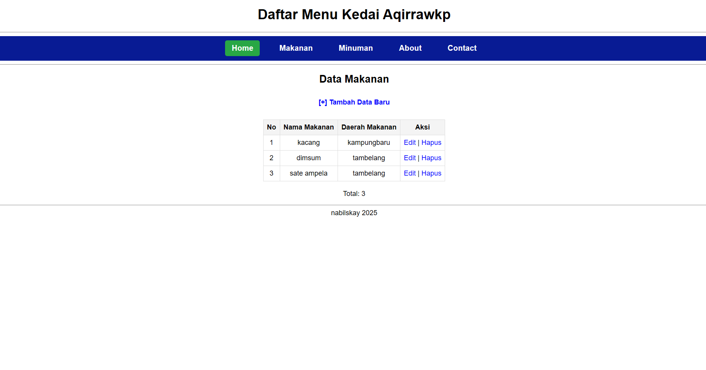
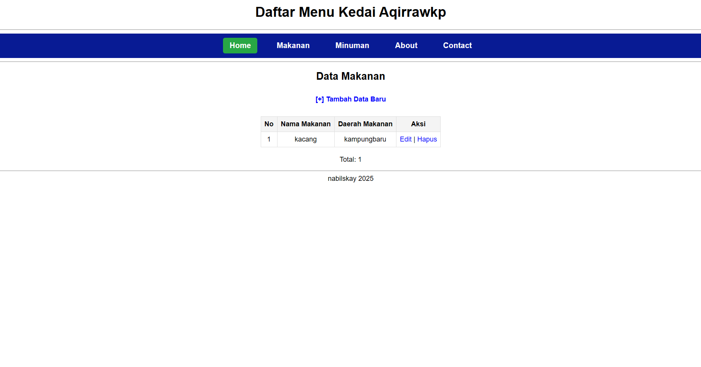
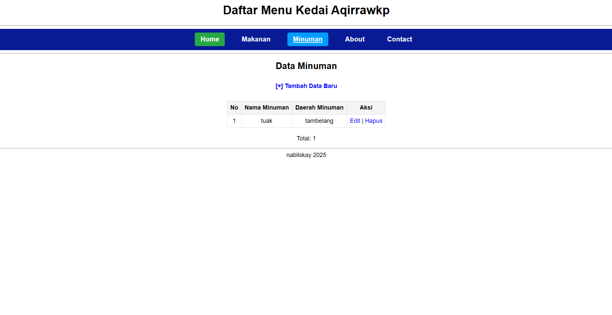
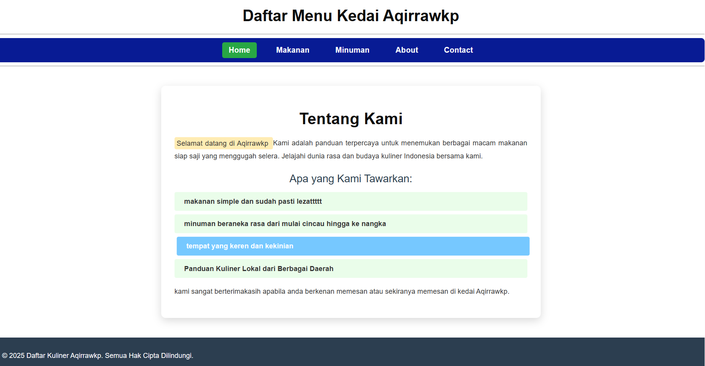
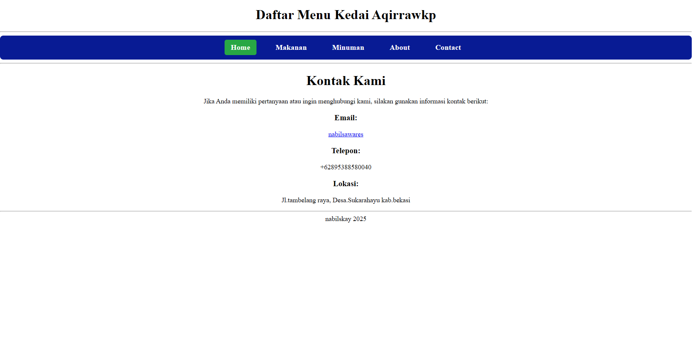

# WEB_KULINER
# UAS B.pemrograman1

| *Nama*             |     Nabil Lio Sawares      |
| -------------------|----------------------------|
| **NIM**            |          312310651         |
| **Kelas**          |          TI.23.A.6         |
| **Mata Kuliah**    |      Pemrograman Web       |
| **Dosen Pengampu** | Eko Budiarto s.kom, m.kom  |

# halaman_home

# halaman_makanan

# halaman_makanan

tambah data

# halaman_makanan

data berhasil ditambah

# halaman_makanan

edit data

# halaman_makanan

data berhasil diedit

# halaman_makanan

data berhasil dihapus

# halaman_minuman

# halaman_about

# halaman_kontak

